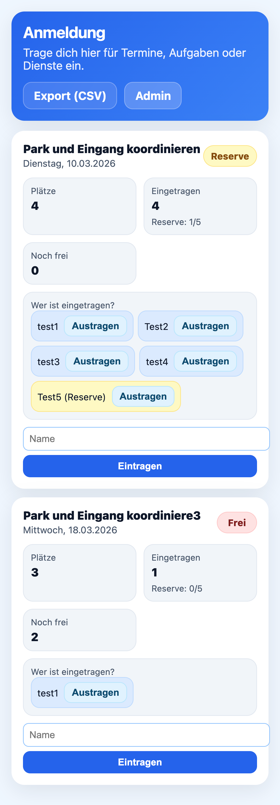
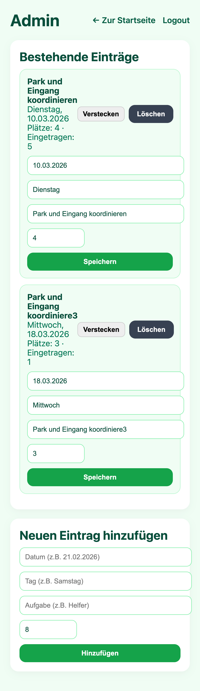

# SignupBoard

A simple self-hosted signup board for tasks, events and volunteer slots.

SignupBoard allows users to register for limited slots.
Once the defined number of slots is filled, additional users are automatically placed on a reserve list.

The application is lightweight and uses JSON files instead of a database, making it easy to deploy on almost any PHP webserver.

## Features

- Simple signup system
- Automatic reserve list
- Admin panel for managing entries
- JSON based storage (no database required)
- Mobile friendly UI
- CSV export
- Self-hosted

---

# Screenshots

## User Interface

  

Users can sign up for available slots.  
If all slots are filled, additional users are placed automatically in the reserve list.

---

## Admin Panel

  

Admins can:

- create entries
- edit entries
- hide entries
- delete entries
- configure texts

---

# Installation

1. Upload the files to your webserver
2. Ensure PHP 8+ is installed
3. Make sure the following files are writable:
